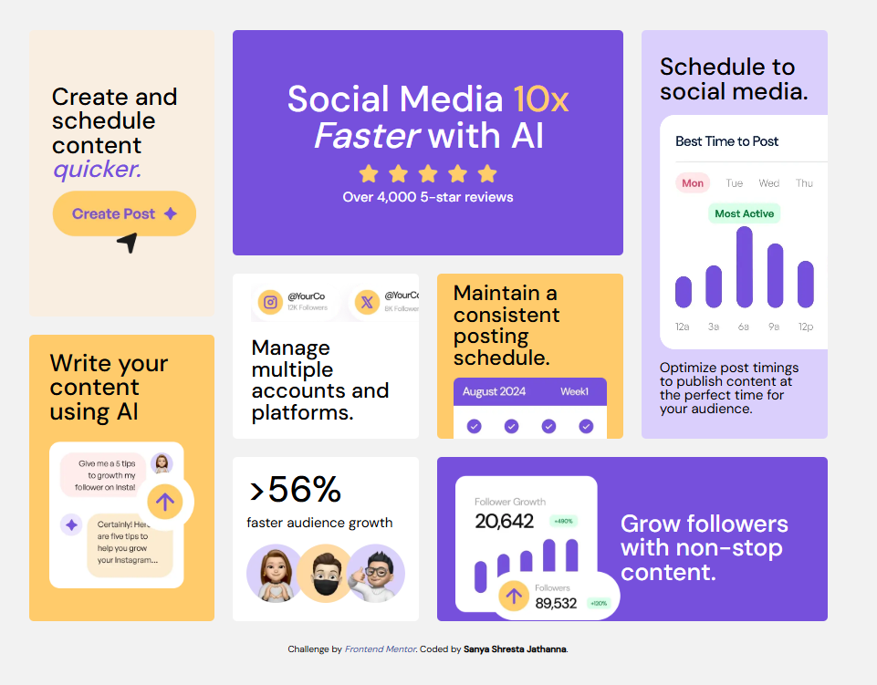

# 🚀 Bento Grid – 10x Faster Social Media Management with AI

This is my creative solution to the [Bento Grid Challenge on Frontend Mentor](https://www.frontendmentor.io/challenges/bento-grid-RMydElrlOj)

---

## 📋 Table of Contents

* [🌟 Overview](#-overview)

  * [The Challenge](#the-challenge)
  * [Screenshot](#screenshot)
  * [Live Preview](#live-preview)
* [🛠️ My Process](#-my-process)

  * [Built With](#built-with)
  * [What I Learned](#what-i-learned)
  * [Continued Development](#continued-development)
  * [Useful Resources](#useful-resources)
* [👨‍💻 Author](#-author)
* [🙏 Acknowledgments](#-acknowledgments)

---

## 🌟 Overview

### The Challenge

Users should be able to:

* ✅ View a responsive, optimized layout across devices
* ✅ Experience a functional and aesthetic bento-style grid

### Screenshot

### Live Preview

* 💻 **Solution URL**: [See the code](https://github.com/SanyaShresta25/Bento-Grid)
* 🌐 **Live Site URL**: [View it in action](https://bento-grid-tau-dusky.vercel.app/)

---

## 🛠️ My Process

### Built With

* ✅ Semantic **HTML5**
* 🎨 **CSS Grid** + Flexbox for layout mastery
* 💡 **CSS custom properties** for theme consistency
* 🧩 **Component-based architecture**
* ✅ **Mobile-first** responsive design

### What I Learned

I learned how to use CSS Grid effectively to structure a visually engaging, responsive layout. This helped me understand how to break a complex design into manageable, reusable parts.

### 📚 Useful Resources

* [Frontend Mentor Community](https://www.frontendmentor.io/)
* [CSS Tricks](https://css-tricks.com/)
* [A11y Style Guide](https://a11y-style-guide.com/) – for better accessibility

---

### 👨‍💻 Author

* Portfolio – [Sanya Shresta Jathanna](https://sanyashresta.netlify.app/)
* Frontend Mentor – [@SanyaShresta25](https://www.frontendmentor.io/profile/SanyaShresta25)
* Twitter – [@sanya_shresta](https://x.com/sanya_shresta)

---

### 🙏 Acknowledgments

Big shoutout to:

* 🎨 The designers of the Bento concept — stunning work!
* ☕ Coffee, for being my co-pilot through it all.

